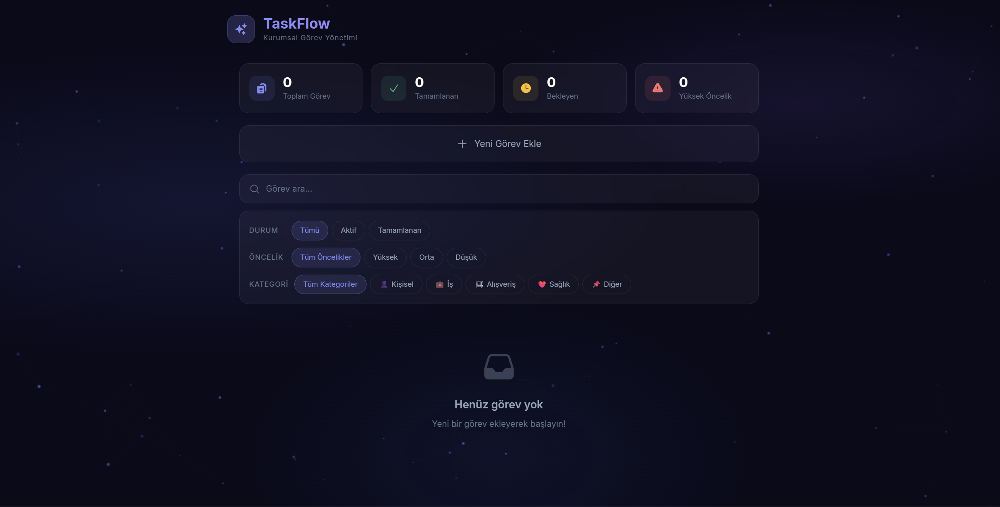

<div align="center">

# ✦ TaskFlow

### 🏢 Kurumsal Görev Yönetim Platformu

Modern, animasyonlu ve kurumsal düzeyde bir görev yönetim uygulaması.
React + Vite + TypeScript + Tailwind CSS ile geliştirilmiştir.



</div>

---

## 🌟 Proje Hakkında

**TaskFlow**, günlük görevlerinizi kolayca yönetmenizi sağlayan modern bir web uygulamasıdır. Kurumsal düzeyde tasarlanmış arayüzü, akıcı animasyonları ve kullanıcı dostu yapısıyla görev takibini keyifli bir deneyime dönüştürür.

> 💡 Bu proje, **Web Geliştirme & JavaScript** eğitimi kapsamında hazırlanmıştır.

---

## ✨ Özellikler

| Özellik | Açıklama |
|---------|----------|
| ➕ **Görev Ekleme** | Başlık, açıklama, öncelik ve kategori ile yeni görevler oluşturma |
| 📋 **Görev Listeleme** | Tüm görevleri animasyonlu kartlar halinde görüntüleme |
| ✏️ **Görev Güncelleme** | Mevcut görevleri düzenleme ve tamamlanma durumunu değiştirme |
| 🗑️ **Görev Silme** | Onay diyalogu ile güvenli silme işlemi |
| 🔍 **Arama** | Görev başlık ve açıklamalarında anlık arama |
| 🏷️ **Filtreleme** | Durum, öncelik ve kategori bazlı filtreleme |
| 📊 **İstatistikler** | Toplam, tamamlanan, bekleyen ve yüksek öncelikli görev sayıları |
| 💾 **Veri Kalıcılığı** | localStorage ile sayfa yenilense bile veriler korunur |

---

## 🎨 Tasarım & Animasyonlar

- 🎬 **Preloader** — Orbiting rings + progress bar ile animasyonlu yükleme ekranı
- 🌌 **Animated Background** — Canvas üzerinde particle network arka plan
- 🪟 **Glassmorphism** — Backdrop blur ile cam efektli modern kartlar
- 🌙 **Dark Theme** — Göz yormayan koyu renk paleti
- ✨ **Micro-animations** — Framer Motion ile hover, tıklama ve geçiş efektleri
- 📱 **Responsive** — Mobil, tablet ve masaüstü uyumlu tasarım

---

## �️ Kullanılan Teknolojiler

<div align="center">

| Teknoloji | Versiyon | Kullanım Alanı |
|-----------|----------|---------------|
| ⚛️ **React** | 19 | Kullanıcı Arayüzü |
| ⚡ **Vite** | 8 | Build & Dev Server |
| 🔷 **TypeScript** | 5.7+ | Tip Güvenliği |
| 🎨 **Tailwind CSS** | 4 | CSS Framework |
| 🎭 **Framer Motion** | 12 | Animasyonlar |
| 🎯 **React Icons** | 5 | İkon Kütüphanesi |

</div>

---

## 📦 Kurulum ve Çalıştırma

### Ön Gereksinimler
- 📌 Node.js (v18 veya üzeri)
- 📌 npm

### Adımlar

```bash
# 1️⃣ Projeyi klonlayın
git clone https://github.com/EMRSoftware/TaskFlow.git
cd TaskFlow

# 2️⃣ Bağımlılıkları yükleyin
npm install

# 3️⃣ Geliştirme sunucusunu başlatın
npm run dev

# 4️⃣ Production build alın (isteğe bağlı)
npm run build
```

Uygulama **[http://localhost:5173](http://localhost:5173)** adresinde çalışacaktır. 🚀

---

## 📁 Proje Yapısı

```
src/
├── 📂 Components/         # UI Bileşenleri
│   ├── AnimatedBackground.tsx   # 🌌 Parçacık animasyonlu arka plan
│   ├── ConfirmDialog.tsx        # ⚠️ Silme onay diyalogu
│   ├── FilterBar.tsx            # 🏷️ Durum/öncelik/kategori filtreleri
│   ├── Header.tsx               # 🔝 Uygulama başlığı ve logo
│   ├── Preloader.tsx            # 🎬 Yükleme ekranı animasyonu
│   ├── SearchBar.tsx            # 🔍 Görev arama çubuğu
│   ├── StatsPanel.tsx           # 📊 İstatistik kartları
│   ├── TaskCard.tsx             # 🃏 Görev kartı bileşeni
│   ├── TaskForm.tsx             # 📝 Görev ekleme/düzenleme formu
│   └── TaskList.tsx             # 📋 Görev listesi
│
├── 📂 Pages/                # Sayfalar
│   └── HomePage.tsx             # 🏠 Ana sayfa
│
├── 📂 Interfaces/           # TypeScript Arayüzleri
│   └── Task.ts                  # 📄 Görev veri modeli
│
├── App.tsx                  # ⚛️ Ana uygulama bileşeni
├── main.tsx                 # 🚀 Giriş noktası
└── index.css                # 🎨 Global stiller ve tasarım sistemi
```

---

## 📋 CRUD İşlemleri

### ➕ Ekleme (Create)
Yeni görev eklemek için "Yeni Görev Ekle" butonuna tıklayın. Formu doldurun ve "Ekle" ile kaydedin.

### 📖 Listeleme (Read)
Tüm görevler ana sayfada kartlar halinde listelenir. Arama ve filtreleme ile kolayca bulabilirsiniz.

### ✏️ Güncelleme (Update)
Görev kartının üzerine gelin ve kalem ikonuna tıklayın. Bilgileri düzenleyip "Güncelle" ile kaydedin.

### 🗑️ Silme (Delete)
Görev kartının üzerine gelin ve çöp kutusu ikonuna tıklayın. Onay diyalogunda "Sil" ile silin.

---

<div align="center">

**TaskFlow** ile görevlerinizi organize edin! ✦

</div>
